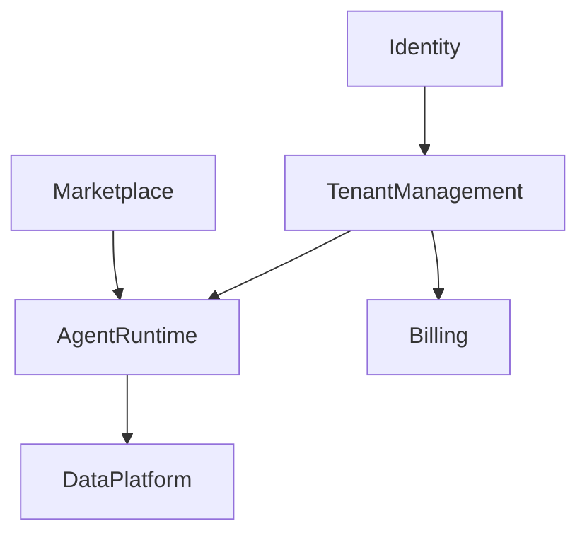

# DOMAIN_MODEL_v00 — BirthHub360 v12

## Bounded Contexts - Mapa Geral (Mermaid)

## Bounded Contexts e Definições

### 1. Identity
- **Responsabilidade:** Autenticação e Autorização global de Usuários e Sistemas.
- **Aggregates:** `User`, `Role`, `Permission`.
- **Domain Events:** `UserRegistered`, `UserLoggedIn`, `UserRoleChanged`.

### 2. TenantManagement
- **Responsabilidade:** Isolamento e gerência do ciclo de vida das organizações clientes.
- **Aggregates:** `Tenant`, `TenantConfiguration`.
- **Domain Events:** `TenantCreated`, `TenantSuspended`, `TenantDeleted`.

### 3. AgentRuntime
- **Responsabilidade:** Orquestração, execução e acompanhamento da frota de agentes Python.
- **Aggregates:** `Agent`, `AgentExecution`, `Pipeline`.
- **Domain Events:** `AgentStarted`, `AgentCompleted`, `AgentFailed`, `PipelineExecuted`.

### 4. Marketplace
- **Responsabilidade:** Exposição e distribuição de `Packs` e `Skills` adicionais que Tenants podem assinar.
- **Aggregates:** `Pack`, `Skill`.
- **Domain Events:** `PackPublished`, `SkillAddedToPack`.

### 5. Billing
- **Responsabilidade:** Cobrança, faturamento e gestão das assinaturas ativas baseadas em uso de recursos.
- **Aggregates:** `Subscription`, `Invoice`.
- **Domain Events:** `SubscriptionStarted`, `SubscriptionRenewed`, `SubscriptionCancelled`.

### 6. DataPlatform
- **Responsabilidade:** Centralização do armazenamento de dados e relatórios.
- **Aggregates:** `DataWarehouse`, `Report`.
- **Domain Events:** `DataSynced`, `ReportGenerated`.

## Glossário de Termos de Domínio do Bounded Context
(Ver UBIQUITOUS_LANGUAGE.md para o dicionário canônico unificado).